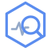
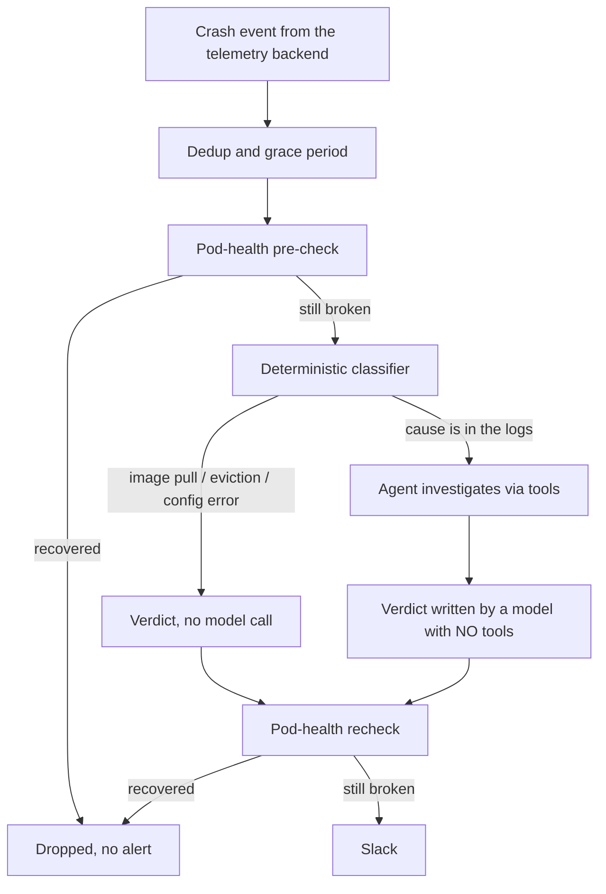

<div align="center">



# Alert Analyzer

**An agent that investigates Kubernetes alerts the moment they fire, and returns a probable root cause instead of a raw alert.**

</div>

A `CrashLoopBackOff` notification tells you a pod is restarting. It does not tell you the container was OOMKilled, or that the image tag does not exist, or that a database driver never recovered its connection pool after a failover. Someone still has to open a terminal and do the same ten minutes of archaeology, usually at an inconvenient hour.

Alert Analyzer does that first pass. It pulls pod state, container logs and metrics through a tool interface, then posts a root cause to Slack with the reasoning behind it.

The interesting part is not that it calls a model. It is how often it refuses to.

## Why it exists

Wrapping an LLM around an alert stream is easy and mostly produces expensive noise. Three problems have to be solved before it is worth deploying:

**Most alerts do not need a model.** When Kubernetes already knows the answer, asking a language model is pure cost and variance. An image that will not pull, an evicted pod, a container whose ConfigMap reference is broken: pod status states all of it plainly. A deterministic classifier answers those with no model call at all, and the model is spent only where the cause is genuinely in the logs.

**Pod logs are untrusted input.** The agent reads text an attacker may control. If that text can steer the final verdict, anyone who can write to a log can suppress an alert by planting `STATUS: resolved`. The verdict step therefore runs with no tools available, and a model verdict alone can never silence an alert.

**Most alerts are noise.** A pod that recovered on its own during a two-minute investigation should not page anyone. Several independent filters exist for that, and every one of them is deterministic.

## Status

Running in production on a client's cluster, triaging live alerts into Slack. Single replica, no leader election, one Bedrock provider. It is a working tool, not a product: see [Limitations](#limitations) before deploying it somewhere that matters.

## How it works



The classifier and the tool-less verdict step are the two decisions that matter. Everything else is plumbing.

## Design decisions

**Deterministic classification before the model.** Failure classes whose cause is complete in pod status are diagnosed directly. This is the K8sGPT pattern: deterministic analyzers first, the model only on the residual. It removes both the cost and the variance from cases where the answer is already known.

**OOMKilled is deliberately *not* one of those classes.** Pod status shows *that* a container hit its memory limit, never *why*: a leak, a load spike and an undersized limit look identical at that layer. A confident one-line "OOMKilled" verdict would be useless, so OOM escalates to a real investigation of the logs and the memory trend.

**The verdict is written by a model that has no tools.** The investigation loop gathers evidence with tools; a separate call then produces the verdict from that evidence with the tool interface removed. Text injected into a pod log cannot trigger an action, because at the moment the verdict is written there is no action available to trigger.

**Only deterministic checks may suppress an alert.** The model's own `STATUS: resolved` is carried for display and is never a suppressor. Silence is decided by a pod-health recheck against the live cluster, immediately before sending.

**Telemetry is pluggable per signal.** Events, logs, metrics and traces are selected independently, so the same binary runs against Groundcover ClickHouse, the Kubernetes API, Loki or Prometheus, in any combination.

| Signal | ClickHouse | Kubernetes API | Loki | Prometheus |
| --- | --- | --- | --- | --- |
| Crash events | yes | yes | - | - |
| Logs | yes | yes | yes | - |
| Metrics | yes, with history | current only | - | yes, with history |
| Traces | yes | - | - | - |

The Kubernetes-native path needs no telemetry stack at all, so it runs on any cluster.

## Quickstart

```console
$ kubectl create namespace observability
$ kubectl -n observability create secret generic alert-analyzer-secrets \
    --from-literal=SLACK_WEBHOOK_URL="https://hooks.slack.com/services/..." \
    --from-literal=CLICKHOUSE_PASSWORD="<password>"
$ helm install alert-analyzer ./chart -n observability \
    --set secrets.existingSecret=alert-analyzer-secrets \
    --set groundcover.clusterName=my-cluster
```

To run with no ClickHouse at all:

```console
$ helm install alert-analyzer ./chart -n observability \
    --set sources.event=kubernetes --set sources.log=kubernetes \
    --set sources.metric=prometheus --set sources.trace=none \
    --set prometheus.url=http://prometheus.observability:9090
```

The pod needs AWS credentials for Bedrock. On EKS, annotate the service account with an IRSA role.

> [!WARNING]
> The chart grants `create` on `pods/exec` cluster-wide by default, which the file and env inspection tools use. Set `rbac.allowExec=false` to drop it; the agent then works from logs and metrics only.

## Limitations

- **Single replica, no leader election.** Two replicas would analyse the same event twice and post duplicate alerts.
- **Amazon Bedrock only.** No other model provider is wired up.
- **Traces are ClickHouse-only.** On any other backend the traces tool reports itself unavailable rather than returning an empty result that reads like evidence of nothing being wrong.
- **The Kubernetes-native event source sees a short window.** Core Kubernetes events are retained about an hour, so a long outage of the analyzer loses the events it was down for. ClickHouse retains far longer.
- **metrics-server has no history.** With `METRIC_SOURCE=kubernetes` the memory reading is a single current sample, which is materially weaker than a trend when judging an OOM.
- **Secret redaction in `get_env` is best-effort**, keyed on variable names. A secret under a benign name still leaks. RBAC is the real boundary, not that filter.
- **No evaluation of diagnosis quality at scale.** The eval harness checks that a verdict names the cause present in recorded evidence. It is a regression signal, not a measure of how often the tool is right in production.

## Repository map

| Path | What is there |
| --- | --- |
| `src/classifier.py` | The deterministic first pass. Short, and the most consequential file |
| `src/agent.py` | Bedrock Converse tool-use loop, and the no-tools verdict step |
| `src/backends/` | Per-signal source protocols and the Kubernetes, Loki and Prometheus implementations |
| `src/clickhouse.py` | Groundcover ClickHouse client and the shared wire types |
| `src/tools.py` | Tools the agent may call. Pod access is a fixed argv over the exec API, never a shell |
| `src/main.py` | Polling loop, dedup, grace periods, the health checks that gate every alert |
| `tests/` | Characterization and regression tests, including the injection and suppression invariants |
| `eval/` | Record-replay harness scoring verdicts against recorded evidence |
| `chart/` | Helm chart |

## Development

```console
$ python -m venv .venv && . .venv/bin/activate
$ pip install -r requirements.txt pytest
$ PYTHONPATH=src pytest tests/ -q
```

Architecture notes and the reasoning behind each suppression rule are in [CLAUDE.md](CLAUDE.md).

## License

MIT. See [LICENSE](LICENSE).
